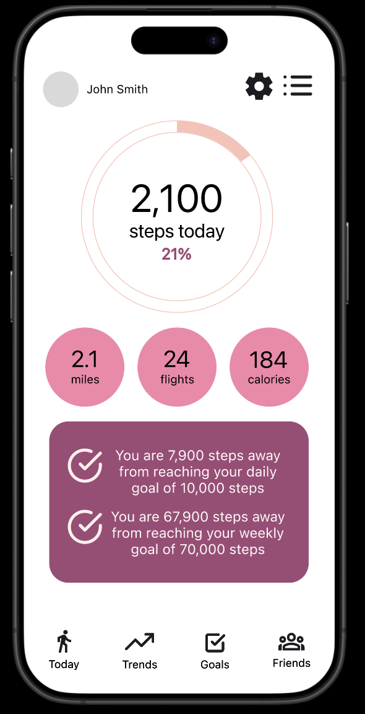
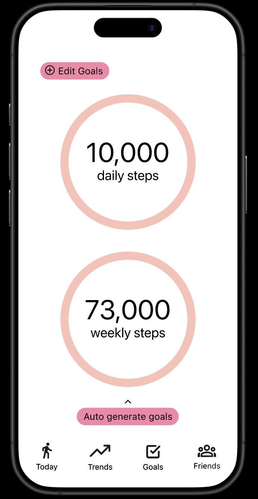
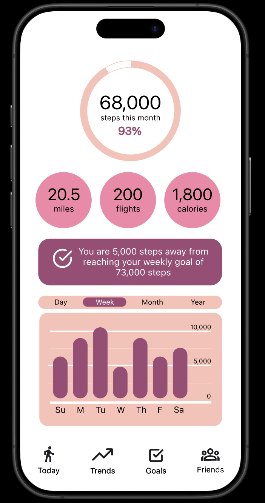

# WalkTracker  
A SwiftUI iOS app that helps users track their daily steps, calories, elevation, and progress toward fitness goals.  
**Built solo using SwiftUI.**

---

## 📱 Screens & Demo  

<div align="center">
  
  
  
</div>

**Walkthrough:**  
1. Open the app  
2. View today’s steps and goal progress  
3. Explore trends, goals, and friends leaderboard  

---

## ✨ Features  

- Track daily steps, distance, calories, and flights climbed  
- Save and view walk history with Core Data persistence  
- Set and update personalized daily step goals  
- Visualize progress with interactive rings and charts  
- Compare weekly and monthly activity statistics  
- View a friends leaderboard with rankings  

---

## 🛠 Skills  

- Implemented data-driven UI with SwiftUI and `@StateObject`/`@ObservedObject`  
- Integrated HealthKit to fetch real-time step, calorie, distance, and flights data  
- Built Core Data manager for local persistence of daily walk records  
- Designed reusable SwiftUI components (`ProgressRing`, `GoalProgressCard`)  
- Created tab-based navigation with multiple feature screens  
- Applied `UserDefaults` for lightweight goal persistence  
- Developed chart visualizations (weekly bars, monthly overview)  
- Added refreshable lists and confirmation UI with SwiftUI alerts  

---

## ⚙️ Tech Stack  

- **Language:** Swift 5  
- **Frameworks:** SwiftUI, HealthKit, Core Data, Foundation  
- **IDE:** Xcode 15+  
- **iOS Target:** iOS 17+  

**Packages:**  
- None (all functionality built with native frameworks)  

---

## 🚀 Setup (Run in 2 Minutes)  

1. Clone the repo:  
   ```bash
   git clone https://github.com/yourusername/walktracker.git
   cd walktracker
   ```
2. Open WalkTracker.xcodeproj in Xcode
3. Select a simulator (or your device)
4. Press Run ▶

The app uses HealthKit. On device, grant permissions when prompted.

## 🔮 Future Improvements  

- Add widgets for lock screen and home screen activity snapshots  
- Implement social sharing and real-time friend data sync  
- Expand charts with more detailed filtering and insights  
- Improve error handling for HealthKit authorization and queries  

---

## 🙏 Credits & Inspiration  

- Built using [CodeDreams](https://codedreams.app/)  
- Apple SF Symbols for icons  
- Apple Developer Documentation and tutorials  

---

## 📄 License & Contact  

**License:** MIT  

**Author:** Tiffany Jia
- [LinkedIn](https://www.linkedin.com/in/tiffanyjia77)  
- tjia38@gatech.edu 
